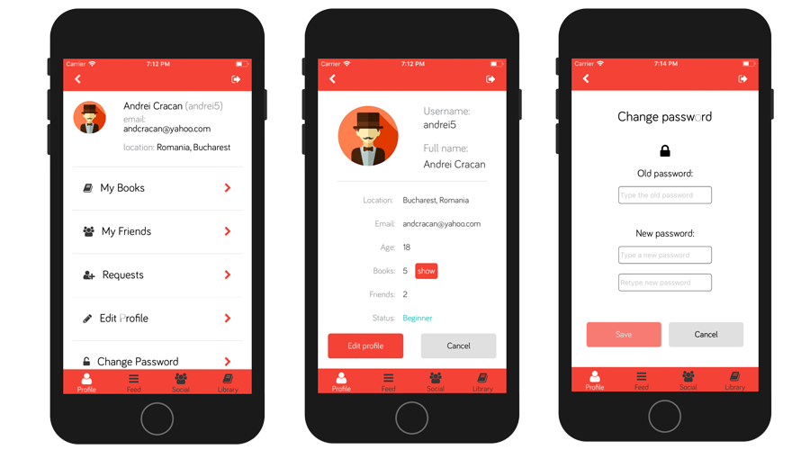
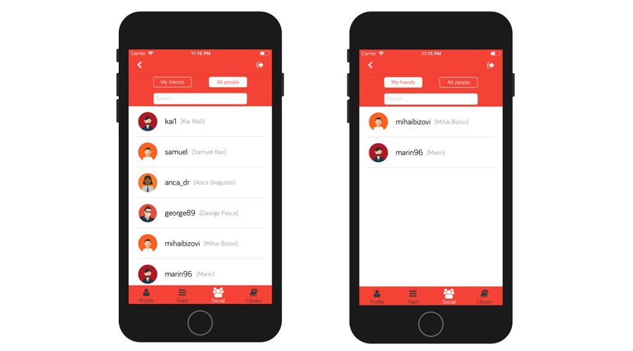
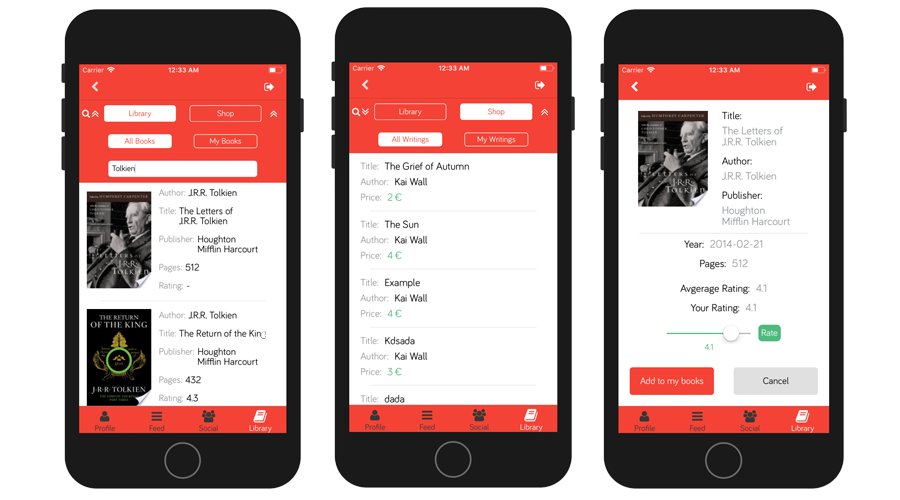

# Welcome to Readoop

##About Readoop
###Summary
Readoop is a social network application built as an iOS app. This application have a very narrow niche and targets specific audience. Readoop is meant to bring together the literature enthusiasts  creating a close community of amateur readers, creative writers and literature critics. The app brings in a set of minimalistic and clean design solutions that makes it very simple and intuitive in usage. 
###Usage
Using the Readoop application the users will have the possibility to rate and store their favorite books in the personal collection. Also the creative writers will have the possibility to add their writings to the internal shop for a symbolic price thus getting a feel of the book selling industry, which would make for a great first time experience. All these functionalities will be wrapped in a intuitive lightweight application.

###Technologies
* [XCode](https://developer.apple.com/xcode/)
* [CocoaPods](https://cocoapods.org/)
* [Realm](https://github.com/realm)
* [NodeJS](https://nodejs.org/en/)
* [ExpressJS](https://expressjs.com/)
* [npm](https://www.npmjs.com/)
* [MongoDB](https://www.mongodb.com/)

###Frameworks
* [Masonry](https://github.com/SnapKit/Masonry)
* [ReactiveObjC](https://github.com/ReactiveCocoa/ReactiveObjC)
* [JHChainableAnimation](https://github.com/jhurray/JHChainableAnimations)
* [TPKeyBoardAvoiding](https://github.com/michaeltyson/TPKeyboardAvoiding)
* [SCLAlertView](https://github.com/vikmeup/SCLAlertView-Swift)

##Features of Readoop
The main features of Readoop are grouped in 4 main categories. This categories are as follows:

###Profile 
In the profile section the users have the possibility to customize their profiles creating an unique identity
as a user of the application.
Main features of this section are

###Profile 
* Changing the avatar
* Editing personal info
* Quick access to your books collection and list of friends

###Social
In the social section the user have the possibility to search for new friends and visualize the list of their current friends.
The main features of this section are
* Searching for new friends (search as you type)
* Acces to current friends list

###Feed
In the feed section the user can post some of his thoughts about any books or authors. Also the users can visualize the posts of other users or the posts
from his friends. The posts can be upvoted or downvoted. The upvotes bring you status points. The statuses are as follows:
* Beginner (0 status points)
* Amateur (10 status points)
* Experienced (50 status points)
* Professional (200 status points)
Startng with the amateur status, the users will have the possibility to post their creative writings.
The features of this section are
* Adding new posts
* Upvotind or downvoting posts from other users

###Library
Library is the main section of the application. In this section users can rate books, add them to their collections and most importantly they can 
add their creative writings if they have the suitable status.
The features of this section are
+ Searching for new books (search as you type)
+ Addin books to personal collection
+ Rating books
+ Adding new writings if you are suitable status-wise (pdf format - from the iCloud drive)
+ Buying and writings writings from other users

## Author's Linkedin 
[Marin Chitan](https://www.linkedin.com/in/chi%C5%A3an-marin-6061ab136/)
Feel free to contact me for any collaborations.

## Additional Info
This application was built as a final project for my bachelor thesis, at the Academy of Economic Studeis Bucharest,
facculty of Economic Informatics.

## Readoop Logo
